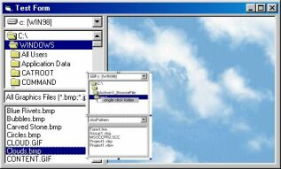



## Active\-X\_BrowseFile

### Description

Don't expect miracle. This is a useable DriveListBox/DirListBox/FileListBox (VB default control) usercontrol. Its purpose is to browse a file. It is fully commented and good for beginner that interested in creating Active-X as a starting point because it only had basic property so you won't get confuse. You can drop this control to your app for quick file browser. Or you can make it as a template to simplified your project that needed the use of the three controls. I need feedback,comments etc., thanx
 
### More Info
 

             |
---                |---
**Submitted On**   |2003-04-07 17:28:30
**By**             |[Mil\-X Pro](https://github.com/Planet-Source-Code/PSCIndex/blob/master/ByAuthor/mil-x-pro.md)
**Level**          |Beginner
**User Rating**    |5.0 (15 globes from 3 users)
**Compatibility**  |VB 6\.0
**Category**       |[Custom Controls/ Forms/  Menus](https://github.com/Planet-Source-Code/PSCIndex/blob/master/ByCategory/custom-controls-forms-menus__1-4.md)
**World**          |[Visual Basic](https://github.com/Planet-Source-Code/PSCIndex/blob/master/ByWorld/visual-basic.md)
**Archive File**   |[Active\-X\_B157065482003\.zip](https://github.com/Planet-Source-Code/mil-x-pro-active-x-browsefile__1-44584/archive/master.zip)

